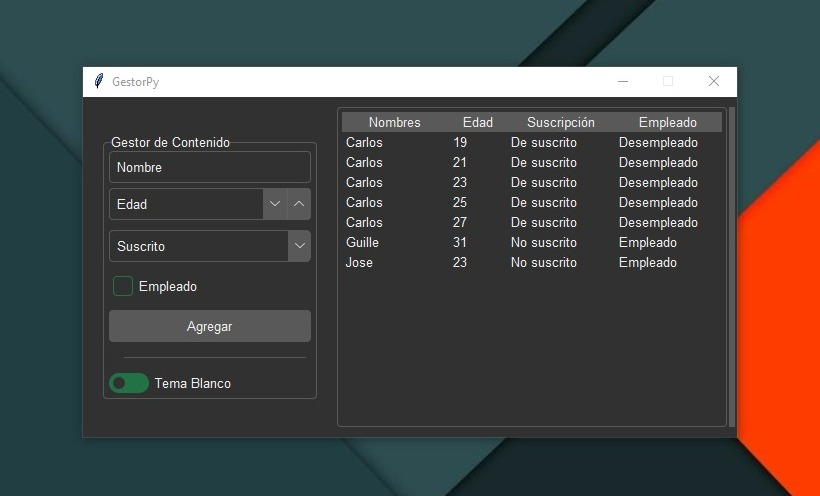

# RegisterPy

## Descripción
RegisterPy es una aplicación de gestión de contenido desarrollada en Python utilizando Tkinter y Openpyxl. Permite a los usuarios ingresar datos como nombres, edad, estado de suscripción y empleo, almacenarlos en un archivo Excel y mostrarlos en una interfaz de tabla.



## Características
- Interfaz de usuario intuitiva con Tkinter.
- Almacenamiento y manipulación de datos utilizando Openpyxl.
- Soporte para cambiar entre temas de interfaz.

## Requisitos
- Python 3.x
- Bibliotecas:
  - tkinter
  - openpyxl

## Instalación
1. Clona este repositorio:
   ```bash
   git clone https://github.com/tu_usuario/RegisterPy.git
   ```
2. Instala las dependencias:
   ```bash
   pip install -r requirements.txt
   ```

## Uso
1. Ejecuta la aplicación:
   ```bash
   python main.py
   ```
2. Completa los campos de entrada y haz clic en "Agregar".
3. Cambia entre temas haciendo clic en "Tema Blanco o Tema Oscuro".
